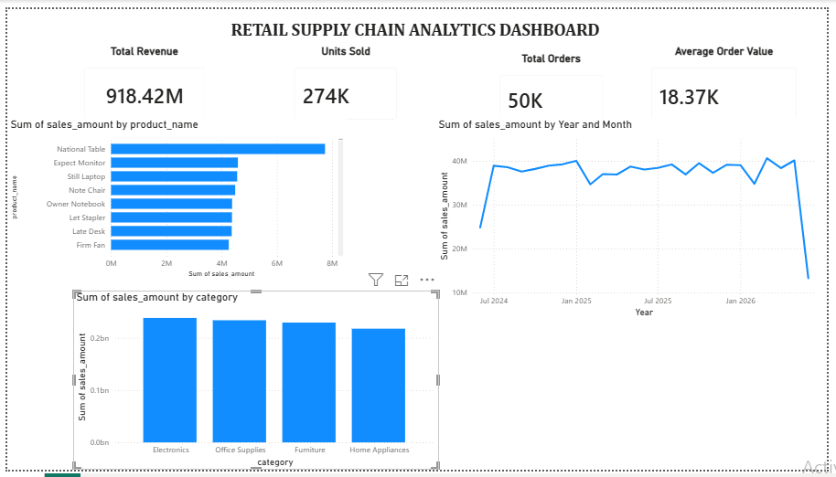

# Retail Supply Chain Analytics

## Project Overview

An end-to-end Retail Supply Chain Analytics project built using Python, SQL, and Power BI. The project simulates a retail supply chain environment, generates transactional data, performs business analysis, and visualizes key insights through interactive dashboards.

The objective is to analyze sales performance, inventory levels, supplier contribution, warehouse operations, and revenue trends to support data-driven business decisions.

---

## Tech Stack

* Python
* Pandas
* NumPy
* Faker
* Matplotlib
* MySQL
* Power BI
* Git & GitHub

---

## Dataset Information

Synthetic retail supply chain dataset generated using Python.

### Data Volume

| Dataset    | Records |
| ---------- | ------: |
| Suppliers  |      20 |
| Products   |     500 |
| Warehouses |       5 |
| Inventory  |   1,000 |
| Orders     |  50,000 |

---

## Project Structure

```text
retail-supply-chain-analytics
│
├── data
│   ├── raw
│   │   ├── suppliers.csv
│   │   ├── products.csv
│   │   ├── warehouses.csv
│   │   ├── inventory.csv
│   │   └── orders.csv
│   │
│   └── processed
│       └── orders_cleaned.csv
│
├── python
│   ├── generate_dataset.py
│   └── exploratory_analysis.py
│
├── sql
│   ├── schema.sql
│   └── analysis_queries.sql
│
├── powerbi
│   └── Retail_Supply_Chain_Analytics.pbix
│
├── images
│   └── dashboard.png
│
└── README.md
```

---

## Key Business KPIs

| KPI                 |    Value |
| ------------------- | -------: |
| Total Revenue       | ₹918.42M |
| Total Orders        |   50,000 |
| Units Sold          |  274,191 |
| Average Order Value |  ₹18.37K |

---

## SQL Analysis Performed

* Overall Business KPIs
* Top Revenue Generating Products
* Monthly Sales Trend Analysis
* Revenue by Category
* Revenue by Warehouse
* Top Suppliers by Product Count
* Inventory Valuation
* Low Stock Product Identification
* Supplier Performance Analysis

---

## Python Analysis

Performed Exploratory Data Analysis (EDA) using Pandas and Matplotlib:

* Dataset inspection
* Missing value analysis
* Statistical summary
* Revenue distribution analysis
* Monthly revenue trend visualization
* Category-wise revenue analysis

---

## Power BI Dashboard

Dashboard Components:

### Executive KPIs

* Total Revenue
* Total Orders
* Units Sold
* Average Order Value

### Sales Analysis

* Monthly Revenue Trend
* Revenue by Category
* Top 10 Products by Revenue

### Business Monitoring

* Supplier Performance
* Product Performance
* Inventory Analysis

---

## Key Insights

* Generated and analyzed 50,000 retail transactions.
* Electronics emerged as the highest revenue-generating category.
* National Table was identified as the top-performing product by revenue.
* Average order value was approximately ₹18.37K.
* Monthly sales trends were analyzed to monitor revenue performance.
* Inventory and supplier data were integrated for operational analysis.

---

## Dashboard Preview


---

## Future Enhancements

* Sales Forecasting
* Demand Prediction
* Automated ETL Pipeline
* Inventory Optimization
* Advanced Power BI Reporting

---

## Author

**Kashish Jain**

BCA Graduate | Aspiring Data Analyst

Skills: SQL, Python, Excel, Power BI, Data Analytics, Data Visualization